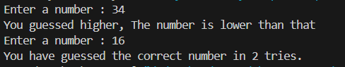

# 🎯 Number Guessing Game 🔢

A classic **Number Guessing Game** built in Python where the computer picks a number between **0 and 100**, and you try to guess it! Simple, interactive, and perfect for Python beginners to practice loops, conditionals, and input handling.

---

## ✨ Features

- 🔢 Random number generation
- 💬 Real-time feedback on guesses
- 🔁 Unlimited attempts until correct
- 🧮 Tracks number of tries

---

## 🔧 Game Rules

- The computer randomly selects a number between **0 and 100**
- You guess a number
- You'll be told if your guess is **too high** or **too low**
- Keep guessing until you get it right!
- Your total number of attempts will be shown at the end

---

## 📷 Screenshot

---

## 🧠 Technologies Used

- Python 3.x  
- Random module  
- Basic input/output operations

---

## 💡 Future Improvements

- Limit the number of guesses  
- Add difficulty levels (Easy, Medium, Hard)  
- Create a GUI version using Tkinter  
- Maintain a high score or leaderboard  

---

## 📄 License

This project is licensed under the MIT License.

---

## 🙌 Acknowledgements

Inspired by traditional number guessing games, rebuilt in Python for learning and fun!

---

# Made with ❤️ by Rachit Khowal
